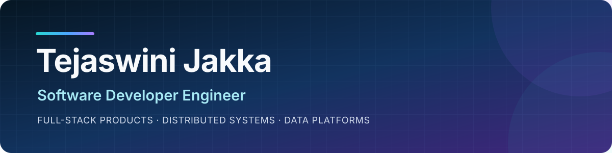
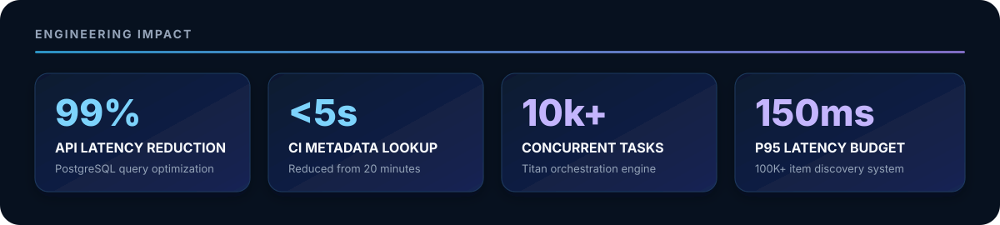

  

<h1 align="center">Hi, I'm Tejaswini Jakka 👋</h1>

<h3 align="center">Software Developer Engineer building responsive products, fast APIs, and reliable distributed systems.</h3>

  
  
  
  

## About me

I'm a software developer engineer working across **React interfaces, backend APIs, data systems, and distributed infrastructure**. I like turning complex data into useful products, making slow services fast, and designing systems that recover when workers fail.

- 🔭 Building interactive data-exploration features at **Global Futures Laboratory** with React, FastAPI, PostgreSQL, and Redis
- 🧭 Previously built engineering tools and backend services at **F5 Networks** and **Darwinbox**
- 🎓 M.S. in Computer Science from **Arizona State University** - **4.0/4.0 GPA**
- 📍 Based in **Tempe, Arizona**
- 💡 Interested in **retrieval quality, experiment design, and fault-tolerant orchestration**

## Engineering impact

  

- ⚡ Reduced a PostgreSQL-backed Trade API from **40 seconds to 20 milliseconds** through indexing and query-plan analysis.
- 🚀 Cut CI build-metadata retrieval from **20 minutes to under 5 seconds**, removing a major developer-feedback bottleneck.
- 🧾 Built payroll, leave, and employee-data APIs processing **50K+ HR records per month**.
- 🛒 Built discovery for a **100K+ item catalog** with a **150ms p95 latency budget**.
- ⚙️ Architected Titan to handle **10K+ concurrent tasks** with failure recovery and autoscaling.

## Technology stack

  

### Languages

### Frontend and backend

### Cloud, data, and delivery

## Featured engineering work

### ⚙️ [Titan: distributed task orchestration engine](https://github.com/tjakka06/Titan)

An open-source Go control plane designed for **10K+ concurrent tasks** across Docker workers.

- Built Docker-based workers, Redis-backed queues, and an autoscaler driven by queue depth.
- Implemented gRPC heartbeats and stateful failure detection across worker nodes.
- Automatically re-queued interrupted jobs to preserve **at-least-once execution** during infrastructure faults.

### 🛒 Marketplace discovery and personalization

A discovery system designed to reduce choice overload across a **100K+ item catalog**.

- Combined vector retrieval, behavioral signals, Redis caching, and FastAPI within a **150ms p95 latency budget**.
- Built an A/B evaluation pipeline for click-through rate, add-to-cart conversion, and ranking quality by cohort.

### 🌐 Interactive data exploration

At Global Futures Laboratory, built React dashboards and reusable FastAPI contracts that let stakeholders explore multi-terabyte datasets through responsive interfaces and APIs.

## Experience

| Period | Role | Organization | Focus |
|---|---|---|---|
| 2025 - Present | **Software Developer** | Global Futures Laboratory | React, FastAPI, PostgreSQL, Redis, interactive data exploration |
| 2022 - 2024 | **Software Engineer** | F5 Networks | Python automation, Flask and Tornado APIs, React internal tools, SQL performance |
| 2022 | **Software Engineer** | Darwinbox | Python and Flask HR services, role-based access, validation, unit testing |

## GitHub stats

  
  

## Education

- **Master of Science in Computer Science**, Arizona State University - GPA: **4.0/4.0**
- **Bachelor of Engineering in Computer Science**, Chaitanya Bharathi Institute of Technology - GPA: **8.5/10.0**

<!-- Certifications and YouTube links are intentionally omitted because none were supplied in the resume or profile information. -->

---

<h3 align="center">Let's build software that's useful, fast, and reliable.</h3>

  <a href="mailto:tejaswinijakka6@gmail.com"><strong>Email</strong></a>
  &nbsp;·&nbsp;
  <a href="https://www.linkedin.com/in/tejaswini-jakka-774366a0/"><strong>LinkedIn</strong></a>
  &nbsp;·&nbsp;
  <a href="https://tejaswinijakka.github.io/"><strong>Portfolio</strong></a>

