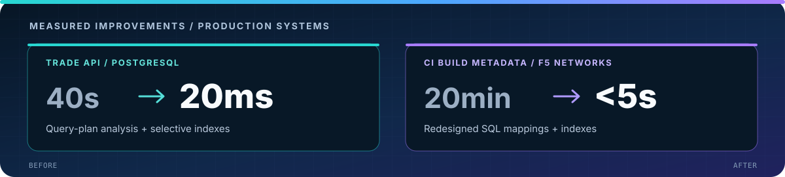
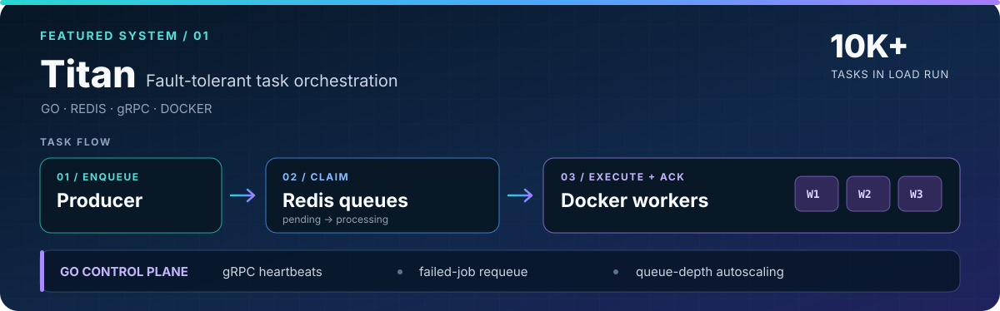

  

  
  

## About

I build **responsive products, fast data APIs, and fault-tolerant systems**. At **Global Futures Laboratory**, I turn complex datasets into React and FastAPI workflows. Previously, I built backend services and internal engineering tools at **F5 Networks** and **Darwinbox**.

## Engineering highlights

  

- Built payroll, leave, and employee-data APIs processing **50K+ HR records per month**.
- Built interactive data-exploration features for **multi-terabyte datasets**.
- Designed marketplace discovery across a **100K+ item catalog**, with a **150ms p95 latency budget**.

## Featured engineering work

### [Titan — distributed task orchestration](https://github.com/tjakka06/Titan)

  

An open-source Go master-worker system with atomic Redis job claims, gRPC worker heartbeats, failed-job requeueing, and queue-depth-based Docker autoscaling. Its load generator can enqueue **10K+ tasks**. [Explore the code and setup →](https://github.com/tjakka06/Titan)

### Marketplace discovery and personalization

Combined **vector retrieval, behavioral signals, Redis caching, and FastAPI** to serve a 100K+ item catalog within a 150ms p95 latency budget. Built an A/B evaluation pipeline for click-through, add-to-cart conversion, and ranking quality by cohort.

### Interactive data exploration

At Global Futures Laboratory, built **React dashboards and reusable FastAPI contracts** so stakeholders could explore large datasets through responsive interfaces and APIs.

## Tools I use

  

**Core:** Python · Go · JavaScript/TypeScript · React · FastAPI · gRPC · PostgreSQL · Redis · Docker

  
Additional languages, frameworks, and platforms

Java · C++ · C# · Flask · Django · REST · MySQL · Kafka · Kubernetes · Linux · CI/CD · HTML/CSS · unit and integration testing

## Experience

| Period | Role | Organization | Focus |
|---|---|---|---|
| 2025–Present | Software Developer | Global Futures Laboratory | React/FastAPI data exploration; PostgreSQL performance |
| 2022–2024 | Software Engineer | F5 Networks | Python services, React tools, CI and SQL optimization |
| 2022 | Software Engineer | Darwinbox | Flask HR APIs, access control, validation and testing |

## Publications

- **[Self-Driving Cars to Drive Autonomously using Deep Learning](https://ijsrem.com/download/self-driving-cars-to-drive-autonomously-using-deep-learning)** — *International Journal of Scientific Research in Engineering and Management*, 2023.
- **[Application for High-Quality Produced Crop Price Forecasting through Deep and Machine Learning](https://www.irjmets.com/uploadedfiles/paper/issue_11_november_2023/45830/final/fin_irjmets1699003081.pdf)** — *International Research Journal of Modernization in Engineering Technology and Science*, 2023. DOI: 10.56726/IRJMETS45830.

## Education

- **M.S. in Computer Science**, Arizona State University — **4.0/4.0 GPA**
- **B.E. in Computer Science**, Chaitanya Bharathi Institute of Technology — **8.5/10.0 GPA**

Most of my day-to-day contributions are in **private team repositories**. GitHub's contribution graph below can show that activity anonymously; [Titan](https://github.com/tjakka06/Titan) is a public code sample.

---

  <strong>Let's build software that's useful, fast, and reliable.</strong> 
  <a href="mailto:tejaswinijakka6@gmail.com">Email</a> · <a href="https://www.linkedin.com/in/tejaswini-jakka-774366a0/">LinkedIn</a>

